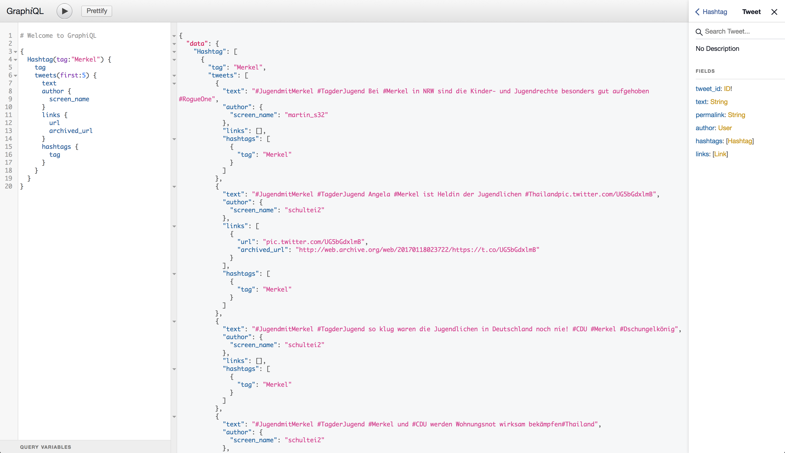
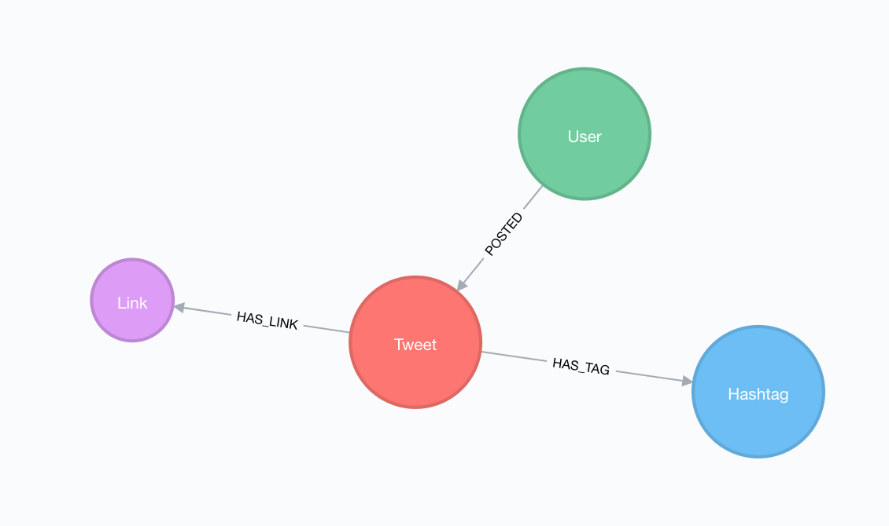
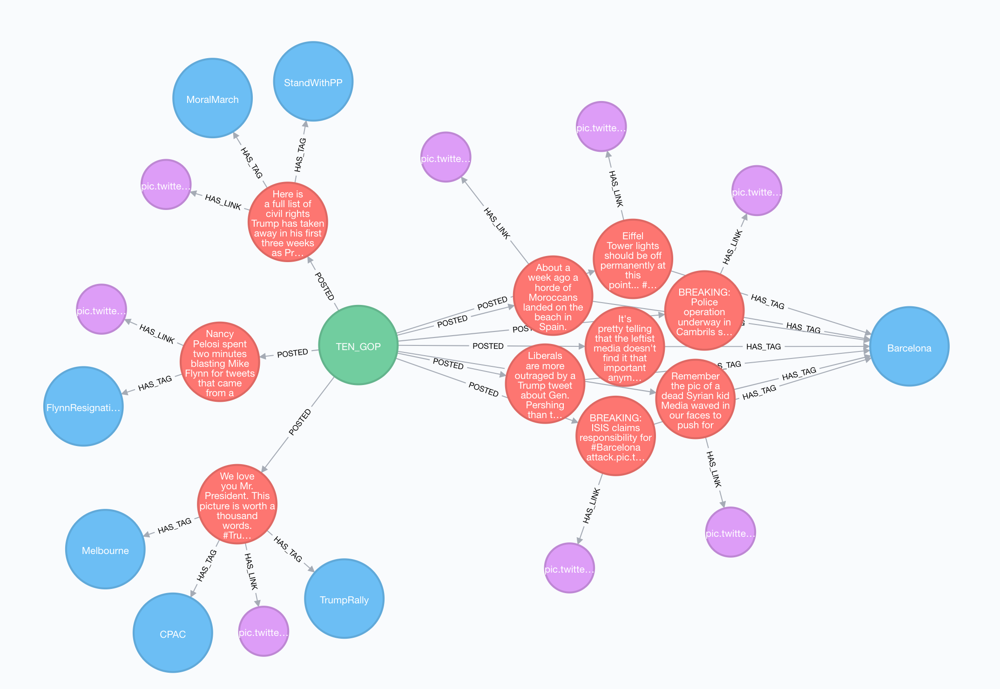

# Russian Twitter Trolls In Neo4j

## Data import - `/import`

The `/import` directory contains 3 Jupyter Notebooks:

* `find_avail_archived.ipynb` - Search Internet Archive's Wayback API for available Twitter user page caches
* `scrape_tweets.ipynb` - Scrape tweets from Internet Archive cached pages
* `neo4j_import.ipynb` - Import tweets into Neo4j

## GraphQL API - `/graphql`

For convenience a GraphQL API is available for querying the data in Neo4j.

## Simple React Search app - `/react`

A simple React web app is available for searching tweets (currently by hashtag). The React app uses the GraphQL API.

### Neo4j

*Datamodel*

*Interesting Queries*

~~~
// Tweets for @TEN_GOP
MATCH (u:User)-[:POSTED]->(t:Tweet)-[:HAS_TAG]->(h:Hashtag)
WHERE u.screen_name = "TEN_GOP"
OPTIONAL MATCH (t)-[:HAS_LINK]->(l:Link)
RETURN *
~~~

~~~
// What hashtags are used by the most users in the dataset
MATCH (u:User)-[:POSTED]->(t:Tweet)-[:HAS_TAG]->(ht:Hashtag)
WITH ht.tag AS hashtag, COLLECT(u.screen_name) AS users
RETURN hashtag, SIZE(users) AS num_users ORDER BY num_users DESC LIMIT 10

╒══════════════════════╤═══════════╕
│"hashtag"             │"num_users"│
╞══════════════════════╪═══════════╡
│"JugendmitMerkel"     │90         │
├──────────────────────┼───────────┤
│"TagderJugend"        │89         │
├──────────────────────┼───────────┤
│"politics"            │61         │
├──────────────────────┼───────────┤
│"news"                │30         │
├──────────────────────┼───────────┤
│"sports"              │28         │
├──────────────────────┼───────────┤
│"Merkel"              │26         │
├──────────────────────┼───────────┤
│"ColumbianChemicals"  │25         │
├──────────────────────┼───────────┤
│"WorldElephantDay"    │22         │
├──────────────────────┼───────────┤
│"crime"               │21         │
├──────────────────────┼───────────┤
│"UnitedStatesIn3Words"│21         │
└──────────────────────┴───────────┘
~~~

~~~
// What hashtags are used together most frequently
MATCH (h1:Hashtag)<-[:HAS_TAG]-(t:Tweet)-[:HAS_TAG]->(h2:Hashtag)
WHERE id(h1) < id(h2)
RETURN h1.tag, h2.tag, COUNT(*) AS num ORDER BY num DESC LIMIT 15

╒═════════════════╤══════════════════╤═════╕
│"h1.tag"         │"h2.tag"          │"num"│
╞═════════════════╪══════════════════╪═════╡
│"JugendmitMerkel"│"TagderJugend"    │89   │
├─────────────────┼──────────────────┼─────┤
│"TagderJugend"   │"WorldElephantDay"│22   │
├─────────────────┼──────────────────┼─────┤
│"JugendmitMerkel"│"WorldElephantDay"│22   │
├─────────────────┼──────────────────┼─────┤
│"JugendmitMerkel"│"Dschungelkönig"  │21   │
├─────────────────┼──────────────────┼─────┤
│"TagderJugend"   │"Dschungelkönig"  │21   │
├─────────────────┼──────────────────┼─────┤
│"Merkel"         │"JugendmitMerkel" │17   │
├─────────────────┼──────────────────┼─────┤
│"Merkel"         │"TagderJugend"    │17   │
├─────────────────┼──────────────────┼─────┤
│"CDU"            │"JugendmitMerkel" │12   │
├─────────────────┼──────────────────┼─────┤
│"CDU"            │"TagderJugend"    │12   │
├─────────────────┼──────────────────┼─────┤
│"TagderJugend"   │"Thailand"        │11   │
└─────────────────┴──────────────────┴─────┘
~~~

~~~
// Most common domains shared in tweets
MATCH (t:Tweet)-[:HAS_LINK]->(u:Link)
WITH t, replace(replace(u.url, "http://", '' ), "https://", '') AS url
RETURN COUNT(t) AS num, head(split(url, "/")) ORDER BY num DESC LIMIT 10

╒═════╤═════════════════════════╕
│"num"│"head(split(url, \"/\"))"│
╞═════╪═════════════════════════╡
│835  │"pic.twitter.com"        │
├─────┼─────────────────────────┤
│120  │"bit.ly"                 │
├─────┼─────────────────────────┤
│105  │"\n\n"                   │
├─────┼─────────────────────────┤
│100  │"pbs.twimg.com"          │
├─────┼─────────────────────────┤
│32   │"vk.com"                 │
├─────┼─────────────────────────┤
│21   │"riafan.ru"              │
├─────┼─────────────────────────┤
│21   │"inforeactor.ru"         │
├─────┼─────────────────────────┤
│20   │"nevnov.ru"              │
├─────┼─────────────────────────┤
│17   │"goodspb.livejournal.com"│
├─────┼─────────────────────────┤
│15   │"www.fox5atlanta.com"    │
└─────┴─────────────────────────┘
~~~

